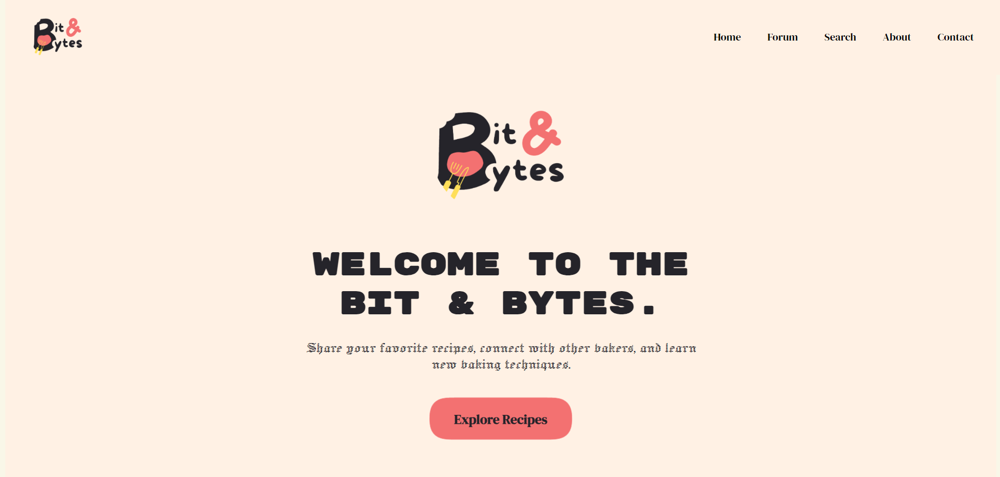
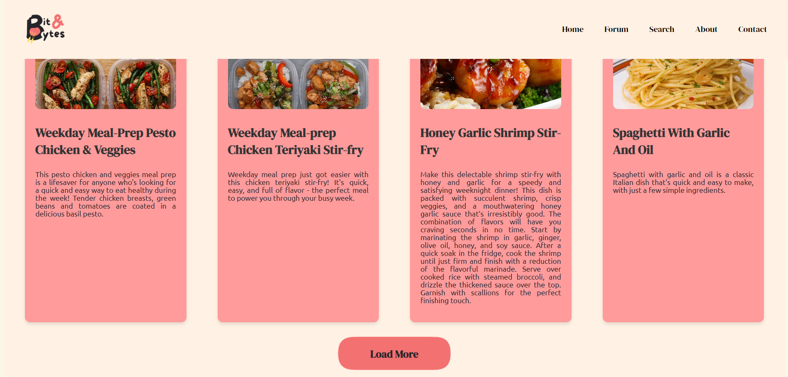
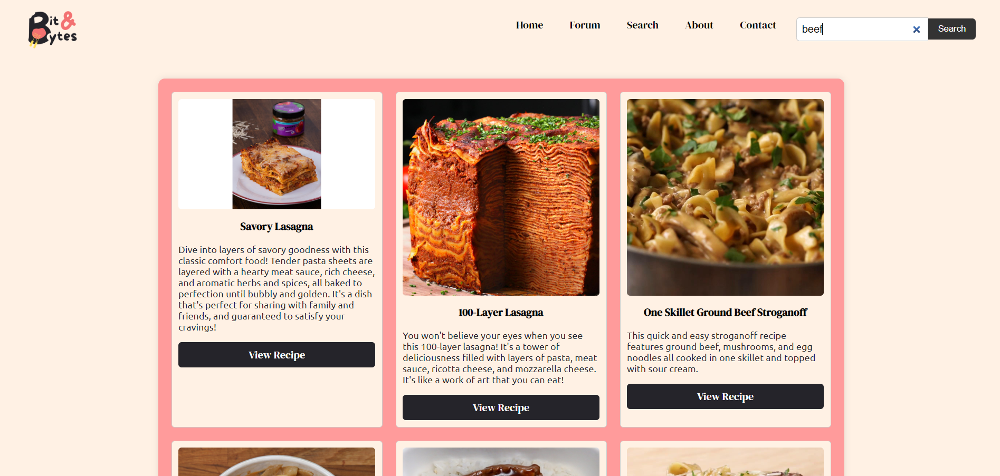
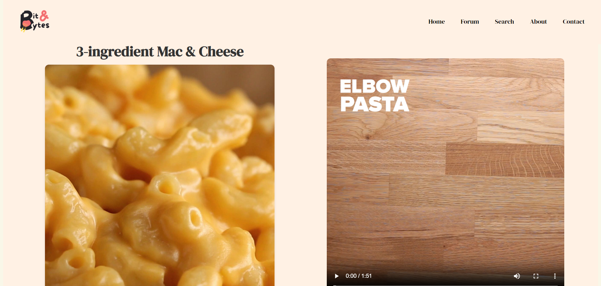
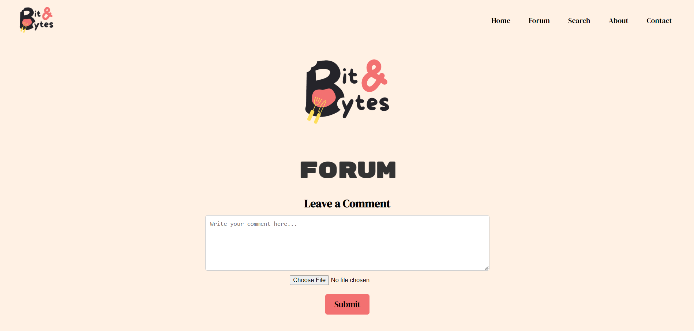
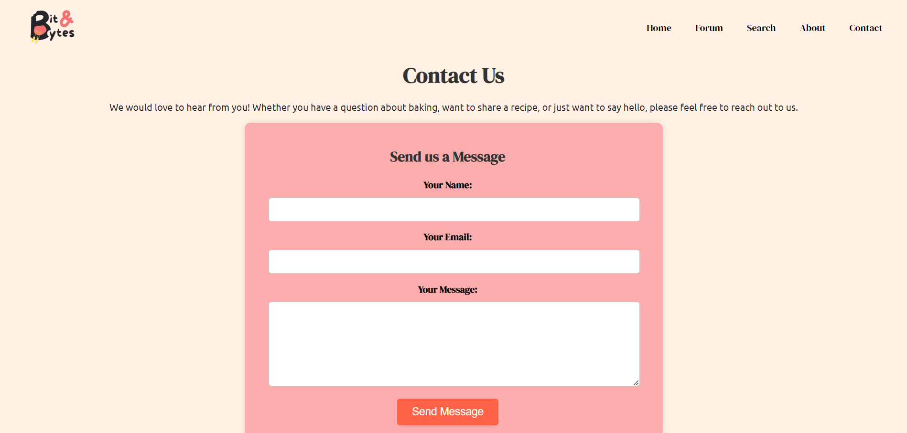

## Features 

- Turn on Apache and MySQL on Xampp Control 

- Run main.html on Localhost to open the page

- *Homepage* will be displayed first, User can click on the explore recipes button to explore new recipes. Click Load more button to display more recipes.

- The recipe card can be clicked and it will bring to the recipe page and display the ingridients , preparations steap and video (some menu might have no video).

- *Forum* page has the comment section where user can submit any comment or share new menu for other user to see. Image can also be uploaded on the page.

- *Search* page has the search bar for user to search ingridients that they want to search for and list of the recipes with the ingredient will be generated.

- *About* page is the introduction to our group.

- *Contact* page is for user to leave meassages to us. User need to enter name, email, and their message and it will be sent to our email.

-API has limit per day

## Group Members 

- Amalia Syazana Binti Mohd Mazlimin
- Farhanah Aina Binti Md Ayub
- Khalisah Najah Binti Nawawi
- Nur Syuhaida Binti Zawawi

## Some UI

